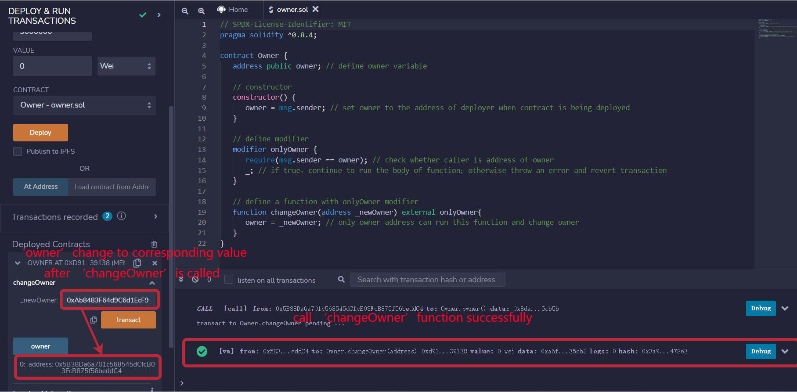
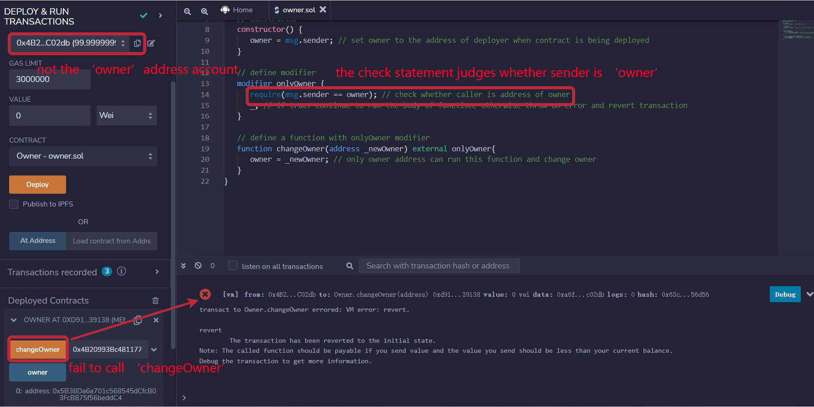

# WTF Solidity Tutorial: 11. Constructor & Modifier

Recently, I have been revisiting Solidity, consolidating the finer details, and writing "WTF Solidity" tutorials for newbies. 

Twitter: [@0xAA_Science](https://twitter.com/0xAA_Science) | [@WTFAcademy_](https://twitter.com/WTFAcademy_)

Community: [Discord](https://discord.gg/5akcruXrsk)｜[Wechat](https://docs.google.com/forms/d/e/1FAIpQLSe4KGT8Sh6sJ7hedQRuIYirOoZK_85miz3dw7vA1-YjodgJ-A/viewform?usp=sf_link)｜[Website wtf.academy](https://wtf.academy)

Codes and tutorials are open source on GitHub: [github.com/AmazingAng/WTFSolidity](https://github.com/AmazingAng/WTFSolidity)

-----

In this section, we will introduce `constructor` and `modifier` in Solidity, using an access control contract (`Ownable`) as an example.

## Constructor
`constructor` is a special function, which will automatically run once during contract deployment. Each contract can have one `constructor`. It can be used to initialize parameters of a contract, such as an `owner` address:

```solidity
   address owner; // define owner variable

   // constructor
   constructor() {
      owner = msg.sender; //  set owner to the deployer address
   }
```

**Note**: The syntax of constructor in solidity is not consistent for different versions: Before `solidity 0.4.22`, constructors did not use the `constructor` keyword. Instead, the constructor had the same name as the contract name. This old syntax is prone to mistakes: the developer may mistakenly name the contract as `Parents`, while the constructor as `parents`. So in `0.4.22` and later version, the new `constructor` keyword is used. Example of constructor prior to `solidity 0.4.22`:

```solidity
pragma solidity = 0.4.21;
contract Parents {
    // The function with the same name as the contract name(Parents) is constructor
    function Parents () public {
    }
}
```

## Modifier
`modifier` is similar to `decorator` in object-oriented programming, which is used to declare dedicated properties of functions and reduce code redundancy. `modifier` is Iron Man Armor for functions: the function with `modifier` will have some magic properties. The popular use case of `modifier` is restrict the access of functions.


Let's define a modifier called `onlyOwner`, functions with it can only be called by `owner`:
```solidity
   // define modifier
   modifier onlyOwner {
      require(msg.sender == owner); // check whether caller is address of owner
      _; // execute the function body
   }
```

Next, let us define a `changeOwner` function, which can change the `owner` of the contract. However, due to the `onlyOwner` modifier, only original `owner` is able to call it. This is the most common way of access control in smart contracts.

```solidity
   function changeOwner(address _newOwner) external onlyOwner{
      owner = _newOwner; // only owner address can run this function and change owner
   }
```

### OppenZepplin's implementation of Ownable：
`OppenZepplin` is an organization that maintains a standardized code base for `Solidity`, Their standard implementation of `Ownable` is in [this link](https://github.com/OpenZeppelin/openzeppelin-contracts/blob/master/contracts/access/Ownable.sol).

## Remix Demo example
Here, we take `Owner.sol` as an example.
1. compile and deploy the code in Remix.
2. click `owner` button to view current owner.
    
3. The transaction succeeds when `changeOwner` function is called by the owner address user.
    
4. The transaction fails when `changeOwner` function is called by other addresses.
    


## Summary
In this lecture, we introduced `constructor` and `modifier` in Solidity, and wrote an `Ownable` contract that controls access of the contract.
